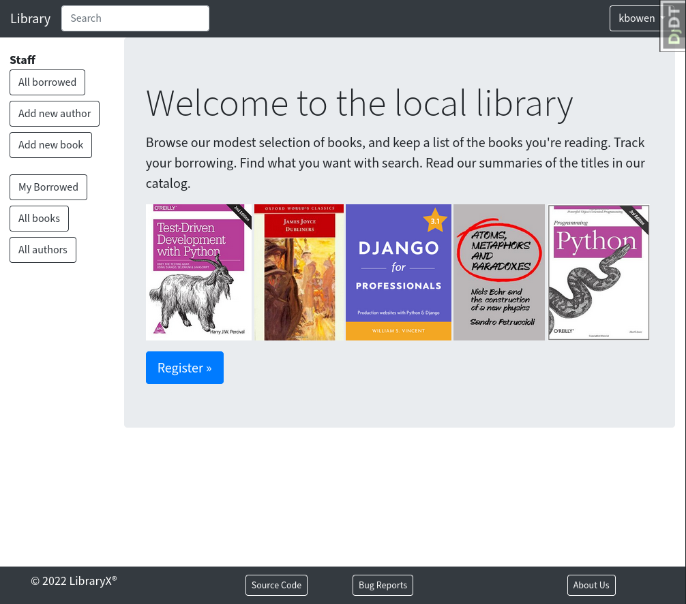

## library

  
  
  

- A lending library built using the Django 5.0.x web framework

##### Table of Contents
 - [Features](#features)
 - [Installation](#installation)
 - [Testing](#testing)
 - [Application Demo](#application-demo)
 - [Screenshots](#screenshots)
 - [Reporting Bugs](#reporting-bugs)

---

### Features
 - Application
     - Add, update, and delete authors and books
     - Borrow, renew, and return books
     - image carousel
     - User registration with email verification & social(GitHub) login using [django-allauth](https://pypi.org/project/django-allauth/)
     - [Bootstrap4](https://pypi.org/project/django-bootstrap4/) & [crispy-forms](https://pypi.org/project/django-crispy-forms/) decorations
     - Customizable user profile pages with bio, profile pic, & [country flags](https://pypi.python.org/pypi/django-countries)
     - For additional links to package resources used in this repository, see the [Package Index](docs/package_index.md)
 - Dev/testing
     - Basic module testing templates
     - [Coverage](https://pypi.org/project/coverage/) reports in `htmlcov` directory
     - [Debug-toolbar](https://pypi.org/project/django-debug-toolbar/) available. See notes in `config/settings.py` for enabling.
     - Examples of using [Factories](https://pypi.org/project/factory-boy/) & [pytest](https://pypi.org/project/pytest/) fixtures in account app testing
     - [shell_plus](https://django-extensions.readthedocs.io/en/latest/shell_plus.html) with [IPython](https://pypi.org/project/ipython/) via [django-extensions](https://pypi.python.org/pypi/django-extensions/) package
     - [Nox](https://pypi.org/project/nox/) testing sessions for latest Python 3.10, 3.11, and 3.12
         - [black](https://pypi.org/project/black/) (`nox -s black`)
         - [Sphinx](https://pypi.org/project/Sphinx/) documentaion generation (`nox -s lint`)
         - linting (`nox -s lint`)
             - [ruff](https://pypi.org/project/ruff/)
             - [djlint](https://pypi.org/project/djlint/)
         - [safety](https://pypi.org/project/safety/)(python package vulnerability testing) (`nox -s safety`)
         - [pytest](https://docs.pytest.org/en/latest/) sessions with
           [pytest-cov](https://pypi.org/project/pytest-cov/) &
           [pytest-django](https://pypi.org/project/pytest-django/) (`coverage run -m pytest`)
  - `run` command menu

    (adapted from Nick Janetakis' helpful [docker-django-example](https://github.com/nickjj/docker-django-example))

    You can run `./run` to get a list of commands and each command has documentation in the run file itself. This comes in handy to run various Docker commands because sometimes these commands can be a bit long to type.

    *If you get tired of typing `./run` you can always create a shell alias with
`alias run=./run` in your `~/.bash_aliases` or equivalent file. Then you'll be
able to run `run` instead of `./run`.*

---

### Installation
 - `git clone https://github.com/kevinbowen777/library.git`
 - `cd library`
 - Local installation:
     - `poetry shell`
     - `poetry install`
     - Comment out the following lines in `accounts/models.py`:
        `library_members, created = Group.objects.get_or_create(name="Library Members")`
        `librarians, created = Group.objects.get_or_create(name="Librarians")`
     - `python manage.py migrate`
     - `python manage.py shell_plus`
         - Create the following groups in the shell:
            - `Group.objects.get_or_create(name="Library Members")`
            - `Group.objects.get_or_create(name="Librarians")`
     - Uncomment the lines previously indicated in `accounts/models.py`
     - `python manage.py createsuperuser`
     - `python manage.py runserver`
 - Docker installation:
     - `docker compose up --build`
     - `docker compose exec web python manage.py migrate`
     - `docker compose exec web python manage.py createsuperuser`
     Additional commands:
       - `docker compose exec web python manage.py shell_plus`
         (loads Django shell autoloading project models & classes)
       - `docker run -it django-start-web bash`
         (CLI access to container)
 - Browse to http://127.0.0.1:8000 or http://127.0.0.1:8000/resources/
 - Pre-commit:
     - To add the hook, run the following command in the poetry shell:
         - `pre-commit install`

---

### Testing
 - `docker compose exec web python manage.py test`
 - `coverage run -m pytest`
 - Nox (includes sessions for black, lint, pyright(typing), safety, tests)
     - testing supported for Python 3.10, 3.11
     - e.g. `nox`, `nox -rs lint-3.11`, `nox -s tests`
       - `nox`
       - `nox -s black-3.12`
       - `nox -s docs-3.11`
       - `nox -rs lint-3.10` (Use the 'r' flag to reuse existing session)
       - `nox -s pyright-3.11`
       - `nox -s safety` (will run tests against all Python versions)
       - `nox -s tests`

---

### Application Demo
A live application demonstration:

TBD

---

## Screenshots

Home page

Catalog Index

Author list

Book list

---
### Reporting Bugs

   Visit the [Issues page](https://github.com/kevinbowen777/library/issues) to view currently open bug reports or open a new issue.
